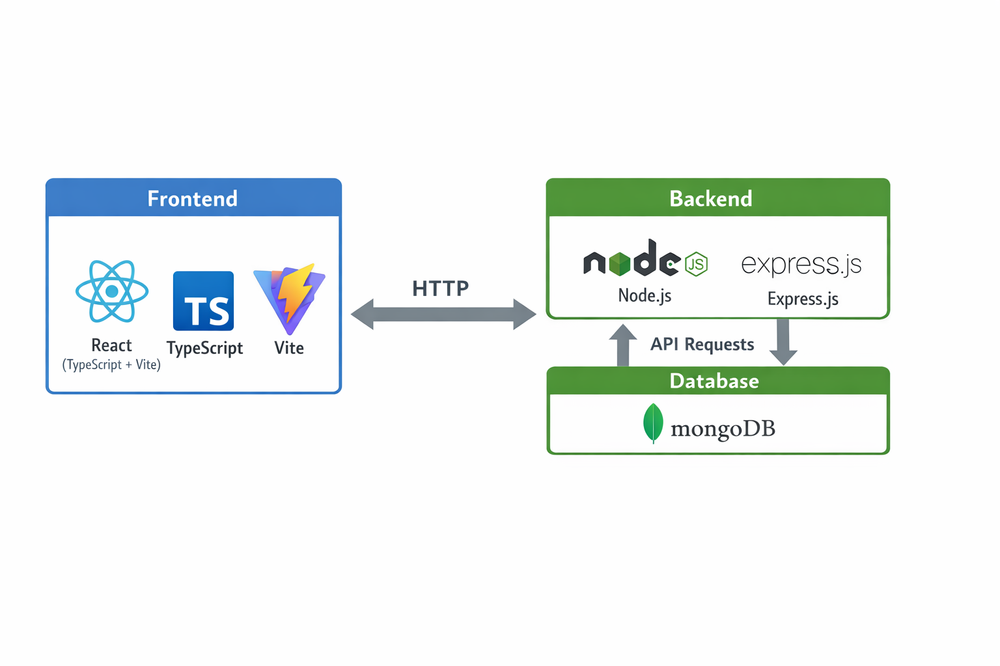

# Guardians of the Chess Grandmaster

**Final Year Project** — BSc (Hons) Computing in Software Development  
**Student:** Tomás Pettit (G00419414) · **Supervisor:** Kevin O'Brien  
**College:** ATU Galway · **Year:** 2025/2026

---

<p align="center">
  
</p>

<p align="center"><strong>Your Chess Journey Awaits</strong></p>

<p align="center">
  <a href="https://final-year-project-pearl-tau.vercel.app/">Live Application</a>
</p>

## 🎬 Screencast Demonstration

> _To be added._

## 📄 Dissertation Document

> _To be added._

## 📚 Overview

**Guardians of the Chess Grandmaster (GOTCG)** is a chess learning platform designed to support players through guided tutorials, game analysis, and skill tracking.

The project combines interactive learning, gameplay tools, and progress-focused features so users can improve systematically—whether they are learning fundamentals or refining higher-level strategy.

## ✨ Features

- 🔒 **Authentication:** Email/password and Google Sign-In via Firebase
- 📅 **Tutorial System:** Learn pieces, rules, and practical winning ideas
- 🎮 **Game Management:** Create, join, and play chess games
- 👤 **Profiles & Progress:** Track rating, game history, and achievements
- 📳 **Real-time Communication:** Live gameplay with Socket.IO
- 🔁 **Responsive PWA:** Mobile-friendly, installable app experience

## 🛠️ Technology Stack

- **Frontend:** React + TypeScript (Vite), Material UI, Framer Motion
- **Backend:** Node.js + Express + Socket.IO
- **Data:** Firebase (Auth + Firestore) and MongoDB (game and analytics data)
- **Deployment:** Vercel (frontend) + Railway (backend)

## 🏗️ Architecture



## 🧭 Project Structure

```text
final-year-project/
├── AI-Model-Dev/
├── backend/
│   └── src/
│       ├── config/
│       ├── routes/
│       ├── schemas/
│       ├── socket/
│       ├── types/
│       ├── utils/
│       └── index.ts
├── docs/
├── frontend/
│   ├── public/
│   ├── scripts/
│   └── src/
│       ├── Components/
│       ├── Context/
│       ├── Pages/
│       ├── Services/
│       ├── Types/
│       └── Utils/
└── integration/
```

## 🚀 Getting Started

### Prerequisites

- Node.js (v22 recommended)
- npm or yarn
- Firebase CLI (`npm install -g firebase-tools`) if needed for Firebase workflows

### 1) Clone the Repository

```bash
git clone https://github.com/tomaspettit2506/final-year-project.git
cd final-year-project
```

### 2) Install Dependencies

Use the module-specific setup guides for full details:

- Frontend setup: [`frontend/README.md`](frontend/README.md)
- Backend setup: [`backend/README.md`](backend/README.md)

### 3) Configure Services

#### Firebase

- Create a project in [Firebase Console](https://console.firebase.google.com/)
- Enable Authentication and Firestore
- Add frontend Firebase config in `frontend/src/firebase.ts`

#### MongoDB

- Create a cluster in [MongoDB Atlas](https://www.mongodb.com/cloud/atlas) (or run MongoDB locally)
- Create a database user and allow network access
- Use the connection string in backend environment variables (`MONGO_URI`)

### 4) Configure Environment Variables

Create these files before running locally.

#### `backend/.env`

```env
MONGO_URI=your_mongodb_connection_string
CLIENT_URL=http://localhost:5173
# Optional: additional allowed frontend origins (comma-separated)
CLIENT_URLS=

# Recommended (base64-encoded Firebase service account JSON)
FIREBASE_SERVICE_ACCOUNT_B64=

# Optional alternative (raw one-line JSON)
FIREBASE_SERVICE_ACCOUNT={...full service account JSON as one line...}

PORT=8000
```

#### `frontend/.env`

```env
VITE_FIREBASE_API_KEY=your_firebase_api_key
VITE_FIREBASE_AUTH_DOMAIN=your_firebase_auth_domain
VITE_FIREBASE_PROJECT_ID=your_firebase_project_id

# Primary backend URL used by the frontend
VITE_API_URL=http://localhost:8000

# Optional fallback supported in code
VITE_BACKEND_URL=http://localhost:8000
```

### 5) Run the App Locally

Start backend and frontend in separate terminals.

- Backend: `npm run dev` from `backend/`
- Frontend: `npm run dev` from `frontend/`

By default:

- Frontend: `http://localhost:5173`
- Backend: `http://localhost:8000`

## 🚢 Production Deployment

### Deployment Overview

- **Frontend:** Vercel
- **Backend:** Railway (WebSocket support required)
- **Databases:** MongoDB Atlas + Firebase

> ⚠️ The backend should **not** be deployed to Vercel because Socket.IO/WebSocket support is required.

### Vercel Frontend → Railway Backend

- Set Vercel env var: `VITE_API_URL=https://<your-backend>.up.railway.app`
- Set Railway env var: `CLIENT_URL=https://<your-frontend>.vercel.app`
- If needed, set `CLIENT_URLS` (comma-separated) for additional frontend origins
- Deploy backend first, then redeploy frontend so build-time env vars are applied

### CI/CD (GitHub Actions)

This repository uses:

- `.github/workflows/frontend-deploy.yml`
- `.github/workflows/backend-deploy.yml`

Required repository secrets:

- `VERCEL_TOKEN`
- `VERCEL_ORG_ID`
- `VERCEL_PROJECT_ID_FRONTEND`
- `BACKEND_DEPLOY_HOOK_URL`

## 🤖 AI Model Development

- [AI Model Development README](AI-Model-Dev/README.md)

## 🔗 Integration

- [Integration README](integration/README.md)

## 🔧 Troubleshooting

### Frontend Issues

**Port 5173 already in use**

```bash
lsof -i :5173
kill -9 <PID>
```

**Firebase configuration errors**

- Verify `frontend/src/firebase.ts` matches your Firebase project
- Confirm Firebase Authentication and Firestore are enabled

**Vite hot reload not working**

- Confirm `.env` values are valid
- Restart the dev server
- Hard refresh browser cache

### Backend Issues

**Frontend cannot reach backend**

- Verify backend is running on port `8000`
- In cloud dev environments, ensure port `8000` is public if required
- Confirm `VITE_API_URL` points to the backend URL

**MongoDB connection failed**

- Check `MONGO_URI` (or `MONGODB_URI`) in `backend/.env`
- Verify MongoDB Atlas network allowlist and user credentials

**Firebase service account errors**

- Verify `FIREBASE_SERVICE_ACCOUNT_B64` or `FIREBASE_SERVICE_ACCOUNT`
- Ensure JSON is valid and correctly encoded/formatted

### General Checks

- Frontend reachable at `http://localhost:5173`
- Backend health endpoint responds at `http://localhost:8000/health`
- Environment files exist and were loaded before starting services

## 📝 License

This project is licensed under the MIT License.

## 🧑🏻 Author

Tomás Pettit