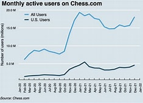
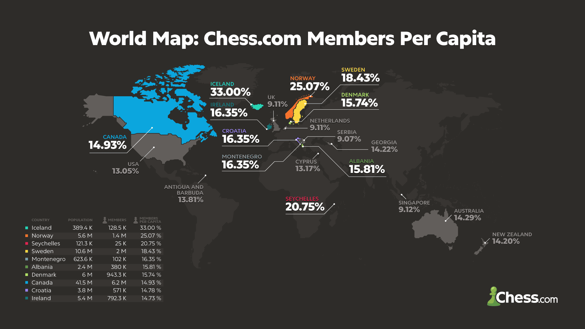
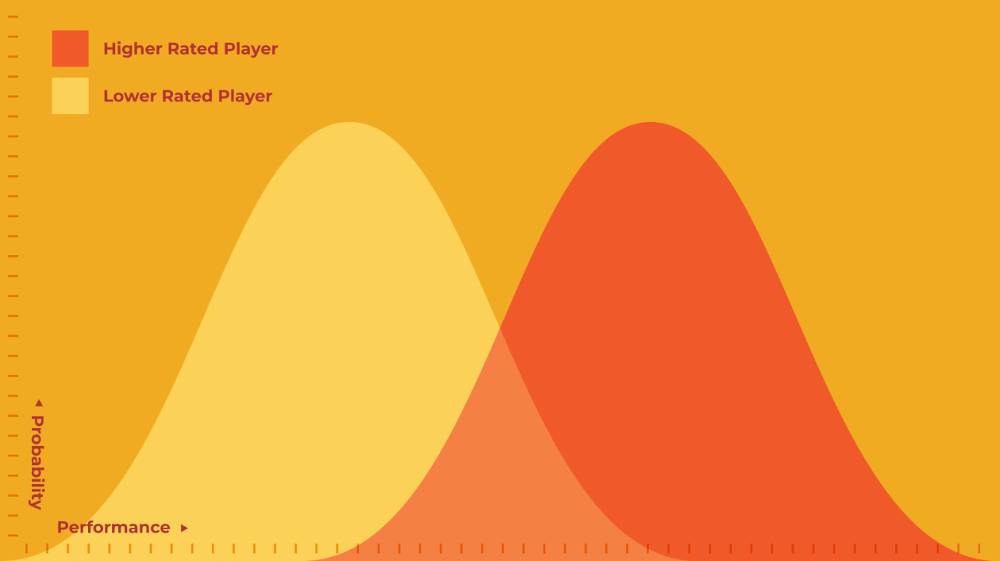

# Research Documentation

## 1. Executive Summary

This research document provides a comprehensive analysis of the chess platform landscape, rating systems, and technology stack for developing a modern chess application. The research encompasses market trends, statistical analysis, technical frameworks, and implementation strategies.

## 2. Market Analysis

### 2.1 Chess Popularity Trends

**Analysis:**
- This visualization demonstrates the exponential growth of chess interest and participation in recent years
- Key factors contributing to the chess boom include:
  - Increased online accessibility through platforms like Chess.com and Lichess
  - The "Queen's Gambit" effect (Netflix series impact)
  - COVID-19 pandemic driving online engagement
  - Streaming and content creation (Twitch, YouTube)
- **Implications:** Large and growing market opportunity for chess-related applications

### 2.2 Global Chess Demographics

**Analysis:**
- Shows distribution of chess players per capita across different regions
- Identifies key markets and user demographics
- Highlights geographic opportunities for platform expansion
- **Implications:** Understanding regional differences helps inform:
  - Localization strategies
  - Server infrastructure placement
  - Marketing focus areas

### 2.3 Geographic Distribution

**Analysis:**
- Visual representation of chess engagement worldwide
- Identifies concentration of players in specific regions
- Shows potential for market penetration in underserved areas
- **Implications:** Strategic considerations for:
  - Multi-language support
  - Time zone considerations for live features
  - Regional tournaments and competitions

## 3. Rating Systems Research

### 3.1 Elo Rating System

**Analysis:**
- The Elo rating system is the industry standard for chess skill measurement
- Originally developed by Arpad Elo, adopted by FIDE (World Chess Federation)
- Mathematical formula accounts for:
  - Expected score based on rating difference
  - K-factor (sensitivity to rating changes)
  - Win/loss/draw outcomes

**Key Components:**
- **Rating:** A numerical value representing a player's skill level
- **K-factor:** Determines the sensitivity of the rating to results
- **Expected score:** The predicted score based on the rating difference

### 3.2 Chess Accuracy Calculator
[Chess Accuracy Calculator - Glow Calculator](https://glowcalculator.com/chess-accuracy-calculator/)

**Analysis:**
- Provides a more nuanced understanding of chess performance
- Accounts for:
  - Game complexity
  - Player skill level
  - Positional factors
- **Implications:** More accurate assessment of player skill and game outcomes

## 4. Technology Stack Analysis

### 4.1 Frontend Technologies
- **React.js:** Component-based library for building user interfaces
- **TypeScript:** Typed JavaScript for better code quality and maintainability
- **Material UI:** Pre-built components for rapid development
- **Lucide React:** Icon library for consistent visual elements

### 4.2 Backend Technologies
- **Node.js:** JavaScript runtime for server-side operations
- **Dotenv:** Environment variable management
- **Firebase Google:** Real-time database and authentication
- **Elo Rating Calculator:** Mathematical calculations for rating systems

### 4.3 Integration Considerations
- **APIs:** Integration with external services
- **Authentication:** User login and session management
- **Data synchronization:** Real-time updates and consistency

## 5. Implementation Strategies

### 5.1 Platform Development
- **Feature set:** Core chess functionalities
- **User experience:** Intuitive and engaging interface
- **Performance:** Fast and responsive

### 5.2 Marketing and User Acquisition
- **Content marketing:** Articles, videos, and tutorials
- **Social media:** Community building and engagement
- **Partnerships:** Collaborations with chess organizations

### 5.3 Monetization
- **Freemium model:** Free basic features, premium features
- **Advertising:** Sponsored content
- **In-app purchases:** Additional features and content

## 6. Research Conclusions and Implications

The research demonstrates that the chess platform market is ripe for innovation and development. The Elo rating system provides a robust foundation for skill measurement, while the global demographics offer significant market opportunities. The technology stack analysis shows that modern frontend and backend technologies can support a scalable and performant application.

The implications for developers and stakeholders include:
- **For developers:** A clear understanding of the market and user needs
- **For stakeholders:** Opportunities for investment and growth

**Website References**
- [Material UI](https://mui.com/material-ui/)
- [Firebase Google](https://firebase.google.com/)
- [TypeScript with React - W3Schools](https://www.w3schools.com/typescript/typescript_react.php)
- [Node.js | Dotenv](https://www.dotenv.org/docs/languages/nodejs)
- [Elo Rating Calculator](https://a2zcalculators.com/sports-calculators/elo-rating-calculator#google_vignette)
- [Chess Accuracy Calculator - Glow Calculator](https://glowcalculator.com/chess-accuracy-calculator/)
- [Lucide React | Lucide](https://lucide.dev/guide/packages/lucide-react)

